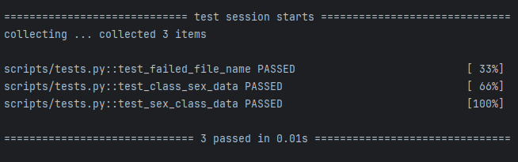

# Лабораторная работа №9
## Описание
Работа по сетевой магистратуре, включающая в себя рабочее веб приложение, созданное с помощью фреймоврка `streamlit`, и тесты с помощью фреймоврка `pytest`. 

## Тестирование
Тестирование приложения ```pytest scrips/tests.py``` проходит успешно:

